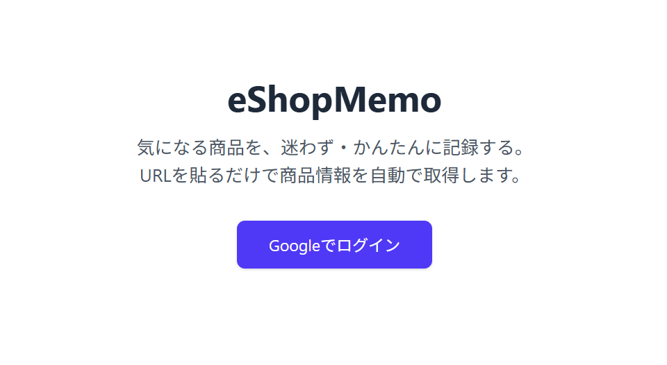
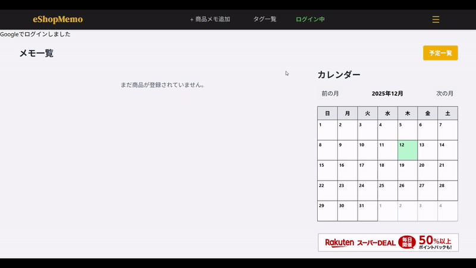
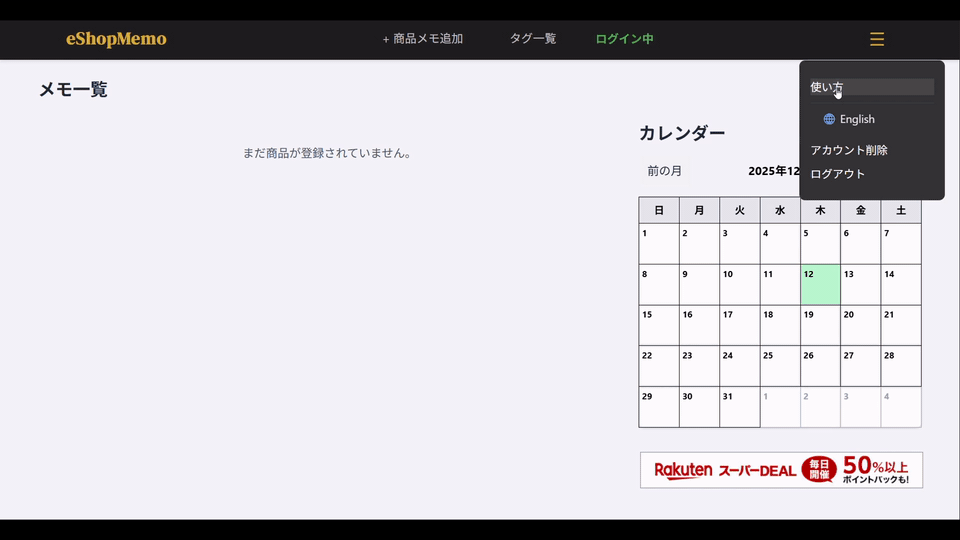
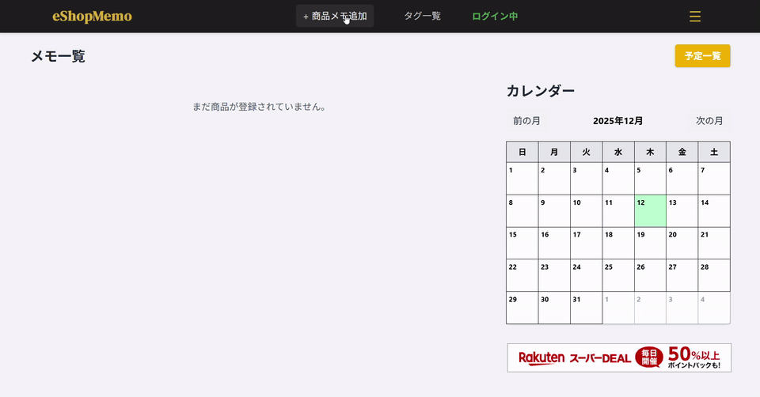
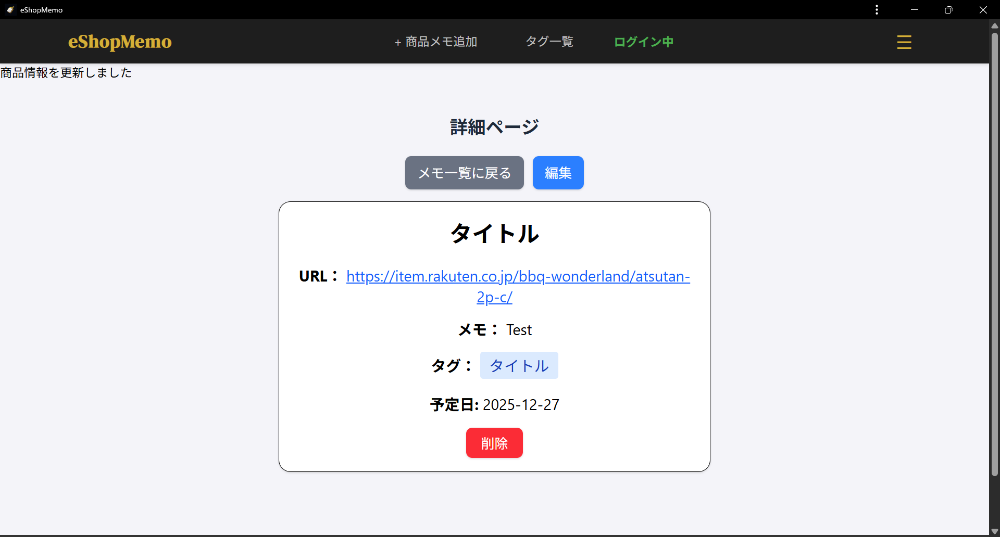
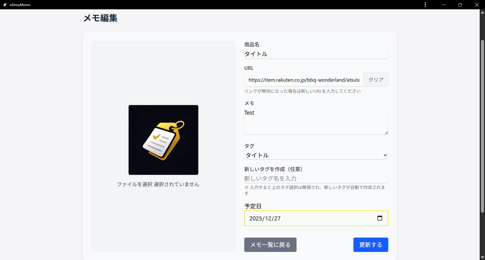
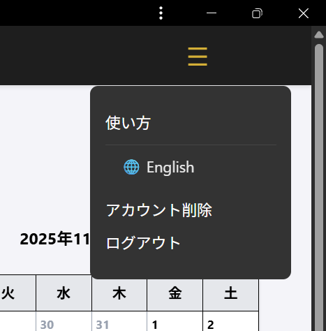
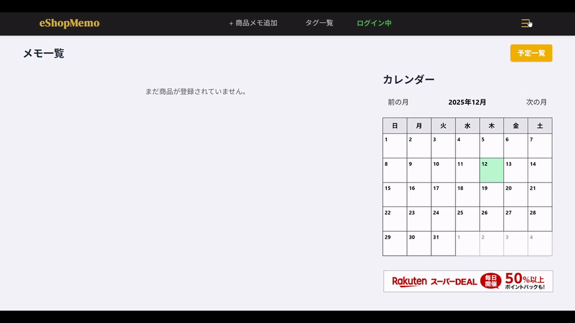
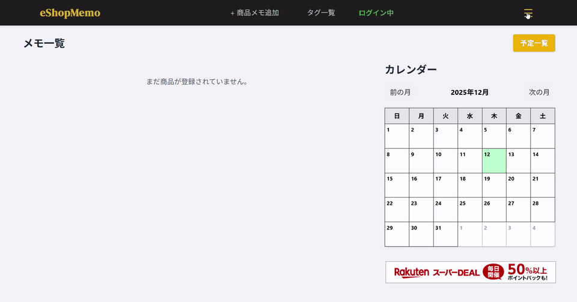

# サービス名 『eShopMemo』

eShopMemo は、通販サイトやSNSで見つけた「気になる商品」を記録・整理できるアプリです。
商品の情報と一緒に「ほしい理由」や「購入予定」などを自由にメモして、あとで見返してじっくり判断できます。

## サービスURL
- [https://eshopmemo.com/](https://eshopmemo.com/)

## このサービスへの思い・作りたい理由
SNSや通販サイトで見かけた商品を「あとで見たい」「買いたい」と思っても、保存先がバラバラになりがちで、結局どこにあるか分からなくなることが多くありました。
そこで「ほしいものリスト」より柔軟に、メモ感覚で商品を記録できるサービスが欲しくて作りました。

## 想定ユーザー
- 通販サイトの商品を一覧で整理したい人
- 「ほしいもの」を誰にも見られずにメモしておきたい人
- SNSに共有するより、自分の中で考えて買い物したい人

## 機能一覧

- **Googleログイン（OAuth2）**  
  Googleアカウントでログインし、ユーザーごとにデータを安全に管理できます。

- **商品URLから商品情報を自動取得**  
  商品URLを登録すると、以下の情報を自動で取得します。  
  - 商品タイトル  
  - サムネイル画像  

- **編集機能（ユーザーによる情報修正）**  
  自動取得した商品情報をユーザーが自由に上書き・編集できます。

- **商品メモ機能**  
  各商品に以下の情報を自由に追加できます。  
  - テキストメモ  
  - 購入予定日  
  - タグ

- **商品一覧 / 詳細 / 編集画面**  
  商品を一覧で整理し、詳細画面で内容を確認、編集画面で自由に更新できます。

- **タグ機能（カテゴリ整理）**  
  タグ一覧ページがあり、タグごとに紐づく商品をまとめて表示できます。

- **リマインダー機能（通知なし）**  
  日付を指定してリマインダーを設定でき、アプリを開いたときに確認できます。

- **PWA対応**  
  スマホのホーム画面に追加して、アプリのように起動して使えます。

## サービスの利用イメージ

### 1. Googleログイン
Googleアカウントを使って簡単にログインできます。

### 2. 基本の使い方
商品を登録して、一覧で確認しながらメモを蓄積できます。

### 3. PWAとしてホーム画面から起動
スマホのホーム画面から起動できるようにする手順です。

### 4. 商品メモ追加（URLから自動取得）
通販サイトやSNSで気になった商品を見つけたら、その商品のURLを eShopMemo に登録します。
登録時に以下の情報を自動で取得し、一覧画面で商品を把握できるようにします。

- 商品名
- サムネイル画像

取得できなかった場合や編集したい場合は、ユーザー自身で上書き・修正が可能です。

### 5. 詳細ページ / 編集

### 6. タグ機能
タグでカテゴリ分けして整理できます。

### 7. リマインダー機能（通知なし）
日付指定でリマインダーを設定できます（通知はなく、アプリを開いたときに確認する設計です）。

### 8. メニュー

### 9. 多言語対応（日本語 / 英語）
言語切替で日本語と英語に対応しています。

### 10. アカウント削除
アカウント削除を行うと、保存した商品情報がすべて削除されます。

## URLが無効になった場合の対応
登録した商品のURLが無効になった場合でも、以下の情報はアプリ内に保持されます。

- 商品名
- サムネイル画像
- ユーザーが入力したメモ

そのため、URLが無効になっても過去に保存した商品の記録を参照できます。
また、ユーザーが編集でURLを更新できます。

## このサービスの価値
各商品には「欲しい理由」「購入予定日」「タグ」などを自由にメモできるため、
ただリンクを保存するだけでなく、自分の考えや検討内容も一緒に残せます。

- 「どのサイトで見つけた商品だっけ？」という迷いをなくせる
- リンク＋メモで、衝動買いせずに冷静に判断できる
- SNS共有ではなく、自分だけのプライベートな“買い物ノート”として活用できる

## サービスの差別化ポイント・推しポイント
eShopMemo は、ただ商品を保存するだけのウィッシュリストではなく「考えるための買い物ノート」です。

1. ウィッシュリスト系（例：Amazon欲しいものリスト / 楽天お気に入り）
   - 既存：商品を保存できるが、他サイトの商品は登録しづらい
   - eShopMemo：複数ECサイトを横断して一元管理できる

2. メモ・ノート系（例：Evernote / Notion）
   - 既存：自由度は高いが、商品情報の登録に手間がかかる
   - eShopMemo：URL登録だけで商品画像と名前を自動取得

3. ショッピング記録系
   - 既存：公開/共有前提のものが多い・英語のみで日本向けUIが使いにくいことがある
   - eShopMemo：共有・公開を前提としないプライベート設計。誰にも見られず本音の検討メモを残せる

### 自由なメモ機能
商品ごとに「ほしい理由」や「迷っているポイント」「購入予定日」などを自由に書き残せます。

### 静かなリマインダー機能
プッシュ通知に追われず、アプリを開いたときに確認できる設計で、自分のペースで検討できます。

### プライベートに整理できる安心感
共有や公開を前提にせず「自分だけの買い物ノート」として使えます。

## 技術スタック
- Backend: Ruby on Rails 8.0.3 / Ruby 3.3.6
- Frontend: Rails標準ビュー + Hotwire（Turbo / Stimulus）
- JavaScript: importmap-rails / Rails UJS
- Styling: Tailwind CSS（tailwindcss-rails）
- DB: PostgreSQL
  - Development: Docker Compose（postgres:14）
  - Production: Render PostgreSQL（Managed Database）
- Auth: Devise + Google OAuth（OmniAuth + omniauth-google-oauth2）
- Storage: Cloudinary
- Data fetch: MetaInspector（metainspector）
- Deploy: Render

## ER図

## 画面遷移図
- Figma: https://www.figma.com/design/rwtuqN0HLm2XZdU9HawibB/%E5%8D%92%E6%A5%AD%E5%88%B6%E4%BD%9C?node-id=9-81&t=qDLCzg7efIQTUVT6-1

